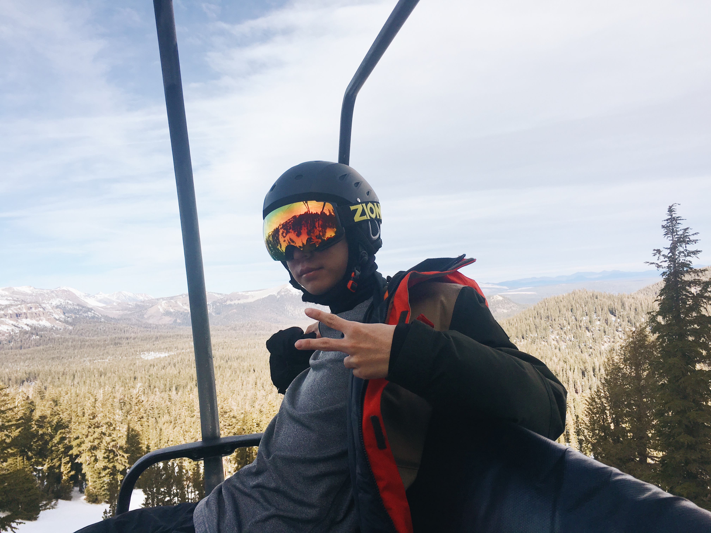

# About Me

* * *

Hi, I'm Nathan Nakamura, and this is my digital portfolio! I am currently a second year student studying computer engineering at the University of California, San Diego. Although I am taking both electrical engineering and computer science courses, I have found that I do like the software side of computers much more than I do the hardware side, which is why I hope to switch into a full-fledged computer science student by the end of this year. After college, I am looking to pursue a job in software engineering related to either machine learning or game development. I am most comfortable with coding in Java and C using the Vim text editor, but I have had experience working with Python, ARM architecture, bash scripting, HTML, CSS, TeX, Matlab, and XML.   

# Hobbies

* * *

When stress is starting to get to me, I usually relax by going to the gym and playing basketball or by loading up a game of League of Legends to play with my friends. Back in high school, I used to spend almost all of my free time with my robotics team to compete in FIRST Tech Challenge (as seen in the video below). I also LOVE to ski during the winter, whether it be with my family or with my friends. 

<iframe width="560" height="315" src="https://www.youtube.com/embed/uFXb6hN2m1M" frameborder="0" allow="accelerometer; autoplay; encrypted-media; gyroscope; picture-in-picture" allowfullscreen></iframe>

 

# Projects

* * *

### FullSent
Full Sent is a Natural Language Processing application which performs sentiment analysis on tweets streamed from Twitter by utilizing the Naive Bayes Classifier from NLTK, the Tweepy API, and Python. From this project, I have developed a handful of skills by teaching myself Python and by working with a RESTful API. My goal for this project is to leverage my newfound knowledge to a commercial machine learning/NLP application.

### Flappy Bird
A Java based rendition of the popular mobile game ”Flappy Bird” that utilizes the Java Swing library to run the game in a separate window. The bird and the pipes on the screen were put into the container as icons, and the movement for the bird and pipes was handled using the KeyListener and ActiveObject libraries. Because of my passion for gaming, I chose to create this game for my high school math and science project. This has inspired my interest in researching game engines like Unity and Unreal Engine.

### This very website!
This was a brand new venture for me as I have had no experience coding in HTML or CSS before this. As such, creating this website was such a great experience because it combined being able to learn something new and challenging with the fun of creating my own website to showcase my abilities to the world.

# Contact Me

* * *

nathannnakamura@gmail.com    

<a href="https://www.facebook.com/profile.php?id=100009548331271&ref=bookmarks">Facebook</a> 

<a href="https://www.linkedin.com/in/nathan-nakamura-7630a1191/">LinkedIn</a>
   
